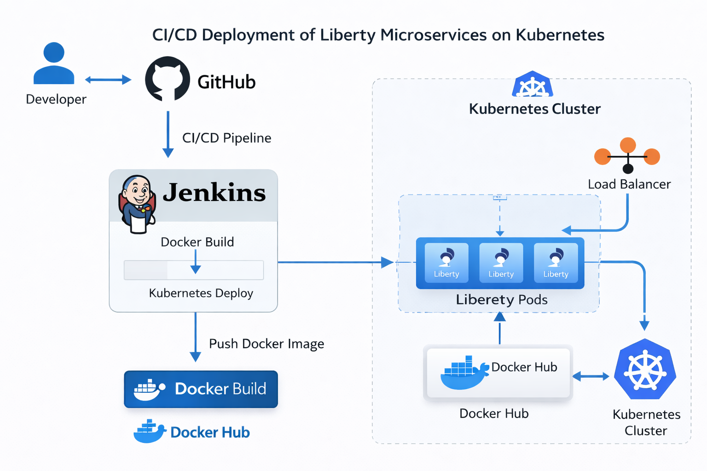

# Kubernetes Liberty Microservices

[](LICENSE)
[](https://hub.docker.com/u/prashanthvedarathna)

A cloud-native microservices project demonstrating **IBM WebSphere Liberty** applications deployed on **Kubernetes** with a complete CI/CD pipeline using **Jenkins**. The project consists of three independent microservices (Product, Order, User) exposing RESTful APIs, containerized with Docker, and orchestrated on a local Kubernetes cluster (Minikube).

## 🏗️ Architecture



The architecture follows a standard CI/CD flow:
1. Developer pushes code to GitHub.
2. GitHub webhook triggers Jenkins pipeline.
3. Jenkins builds the Maven projects and creates Docker images.
4. Images are pushed to Docker Hub.
5. Kubernetes cluster pulls the images and deploys the Liberty pods.
6. An Ingress controller exposes all services via a single endpoint.

## 🛠️ Technologies Used

- **Java 11** – Programming language
- **MicroProfile 4.0** – Enterprise Java APIs for microservices
- **IBM WebSphere Liberty** – Lightweight application server
- **Maven** – Build automation
- **Docker** – Containerization
- **Kubernetes** – Container orchestration (Minikube)
- **Jenkins** – CI/CD automation
- **GitHub** – Source control
- **Docker Hub** – Container registry
- **NGINX Ingress** – External access

## 📋 Prerequisites

- **WSL Ubuntu** (on Windows) or any Linux distribution
- **Java 11** (OpenJDK)
- **Maven** (3.6+)
- **Docker** (20.10+)
- **Minikube** (latest) with `ingress` addon enabled
- **kubectl** (latest)
- **Git**
- **Jenkins** (optional, for CI/CD)

## 🚀 Getting Started

### 1. Clone the Repository

```bash
git clone https://github.com/Prashanthvedaratna/kubernetes-liberty-microservices.git
cd kubernetes-liberty-microservices
